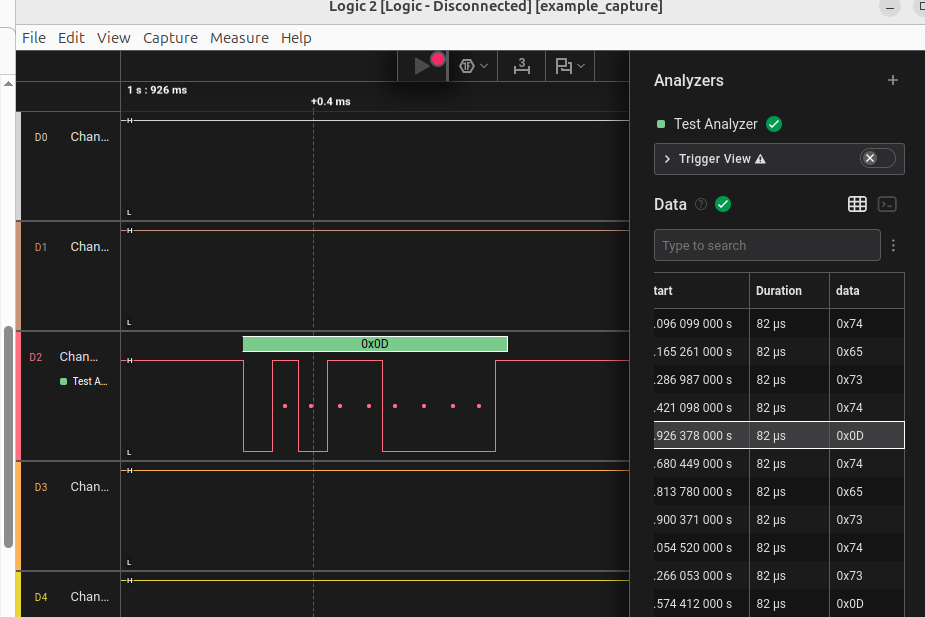
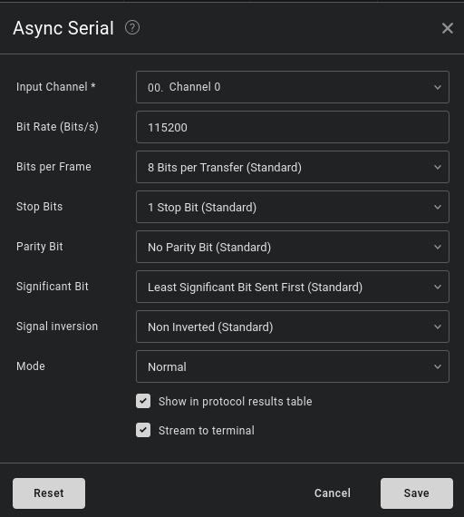

# demo saleae

https://saleae.github.io/logic2-automation/getting_started.html

connect data lanes to 0 and 2 channel and open com ports
```bash 
minicom -D /dev/ttyUSBX
```
run script  src/sl_demo/main.py
```bash 
uv run serial-capture
```
```bash 
rustam@NB-8244:~/python-progs/sl-demo$ tree output-2025-05-17_20-53-05/
output-2025-05-17_20-53-05/
├── digital.csv
├── example_capture.sal
└── serial_export.csv

1 directory, 3 files
```
result serial_export.csv
```bash 
name,type,start_time,duration,"data"
"Test Analyzer","data",1.096099,0.000082,"t"
"Test Analyzer","data",1.165261,0.000082,"e"
"Test Analyzer","data",1.286987,0.000082,"s"
"Test Analyzer","data",1.421098,0.000082,"t"
"Test Analyzer","data",1.926378,0.000082,"
"
"Test Analyzer","data",2.680449,0.000082,"t"
"Test Analyzer","data",2.81378,0.000082,"e"
"Test Analyzer","data",2.900371,0.000082,"s"
"Test Analyzer","data",3.05452,0.000082,"t"
"Test Analyzer","data",3.266053,0.000082,"s"
"Test Analyzer","data",3.574412,0.000082,"
"
```
after run we can open capture data (example_capture.sal) in app

File -> Open Capture



## Additional

in code block strings should be same as settings in ui

```python 
            serial_analyzer = capture.add_analyzer('Async Serial', label=f'Test Analyzer', settings={
                'Input Channel': 2,
                'Bit Rate (Bits/s)': 115200,
                'Bits per Frame': '8 Bits per Transfer (Standard)'
            })
```

